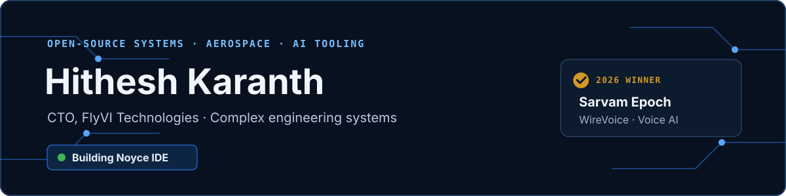
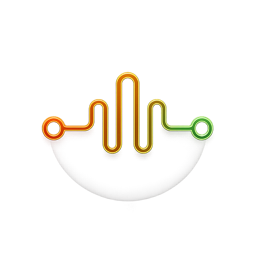
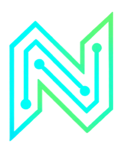
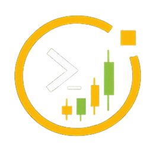
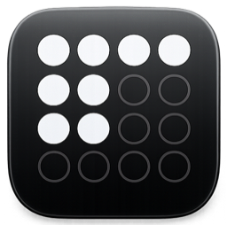
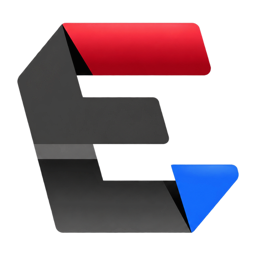

**[CTO at FlyVI Technologies](https://www.flyvitech.com/)** · **[Building Noyce IDE](https://github.com/Hitheshkaranth/noyce-ide-dist)** · **Sarvam Epoch Buildathon Winner**

As CTO at FlyVI Technologies, I work on high-reliability aerospace, defence, power-electronics, and embedded-control systems. In open source, I build tools that make complicated systems easier to inspect, operate, and trust, from financial research and AI usage monitoring to avionics tooling and verifiable firmware development.

> **Currently building:** [Noyce IDE](https://github.com/Hitheshkaranth/noyce-ide-dist), an AI-native Code-OSS workbench for safety-critical firmware, showcased at the [Stanford × DeepMind Hackathon](https://gdg.community.dev/gdg-stanford/).

## Award-winning work

<table>
<tr>
<td width="112" align="center"></td>
<td>
<strong>WireVoice · Sarvam Epoch Buildathon Winner</strong>  
A voice-first assistant for technicians navigating complex electrical schematics. WireVoice uses Sarvam Voice AI to locate terminals, wires, and connections, answer in the technician's preferred language, and cite the exact schematic sheet as its source.  
<a href="https://www.linkedin.com/posts/vinayakgavariya_buildwithsarvam-activity-7493728077878001664-BYc-"><strong>Read the winner announcement →</strong></a>
</td>
</tr>
</table>

## Building now

<table>
<tr>
<td width="112" align="center"></td>
<td>
<h3><a href="https://github.com/Hitheshkaranth/noyce-ide-dist">Noyce IDE</a></h3>

  
An AI-native Code-OSS workbench for safety-critical firmware. It brings DO-178C evidence, MISRA analysis, CBMC, CodeQL, measured MC/DC, traceability, and hardware tooling into one environment, with compliance runs that record exactly what was measured.
  <code>Code-OSS</code> <code>Firmware</code> <code>AI agents</code> <code>Verification</code>
</td>
</tr>
</table>

## Open-source work

<table>
<tr>
<td width="112" align="center"></td>
<td>
<h3><a href="https://github.com/Hitheshkaranth/OpenTerminalUI">OpenTerminalUI</a></h3>

  
A self-hosted financial terminal for traders, researchers, and quant teams. It combines multi-market data, professional charting, derivatives analytics, portfolio and risk workflows, backtesting, paper trading, and tool-using AI research in one browser workspace.
  <code>TypeScript</code> <code>Python</code> <code>FastAPI</code> <code>React</code> <code>Docker</code>
</td>
</tr>

<tr>
<td width="112" align="center"></td>
<td>
<h3><a href="https://github.com/Hitheshkaranth/OpenTokenMonitor">OpenTokenMonitor</a></h3>

  
A lightweight, local-first desktop monitor for Claude, Codex, Gemini, and other AI coding tools. It puts usage, quota windows, activity trends, and cost signals into one privacy-first widget instead of scattering them across provider dashboards.
  <code>Rust</code> <code>Tauri</code> <code>Desktop</code> <code>Local-first</code>
</td>
</tr>

<tr>
<td width="112" align="center"></td>
<td>
<h3><a href="https://github.com/Hitheshkaranth/EmbeddedDisplayStudio">EmbeddedDisplayStudio</a></h3>

  
An HMI platform for embedded Linux panels. The desktop Studio previews Qt applications at exact target-panel geometry, deploys them over SSH, performs health checks, and automatically rolls back failed installations. It ships as a single Windows executable with no Python installation required.
  <code>Python</code> <code>Qt</code> <code>Embedded Linux</code> <code>SSH</code>
</td>
</tr>
</table>

### More public projects

| Repository | What it does | Core technology |
| --- | --- | --- |
| [ARINC 615A CLI Tool Suite](https://github.com/Hitheshkaranth/arinc-615a-cli-tool-suite) | Implements avionics software upload and download workflows over Ethernet, including ARINC 665 media-set management. | C++23 · TFTP · Avionics |
| [NETRA System Debugger](https://github.com/Hitheshkaranth/Netra_System_Debugger_V1) | Turns wearable-sensor telemetry into a live PySide6 debugger and 3D digital twin. | Python · PySide6 · Telemetry |
| [NETRA Device Firmware](https://github.com/Hitheshkaranth/Netra_Device_Firmware_V1) | Captures ultrasonic ranging and MPU6050 motion telemetry on ESP32-C6 hardware. | ESP32-C6 · Firmware · Sensors |

## Contribution history

<a href="https://github.com/Hitheshkaranth?tab=overview">
<picture>
<source media="(prefers-color-scheme: dark)" srcset="https://github-profile-summary-cards.vercel.app/api/cards/profile-details?username=Hitheshkaranth&theme=github_dark">

</picture>
</a>

## Open-source star growth

<a href="https://www.star-history.com/#Hitheshkaranth/OpenTerminalUI&Hitheshkaranth/OpenTokenMonitor&Date">
<picture>
<source media="(prefers-color-scheme: dark)" srcset="https://api.star-history.com/svg?repos=Hitheshkaranth/OpenTerminalUI%2CHitheshkaranth/OpenTokenMonitor&type=Date&theme=dark">

</picture>
</a>

## Tools I build with

My recurring interests are self-hosted specialist software, inspectable AI workflows, quantitative systems, embedded devices, and engineering tools that produce evidence instead of vague confidence.

## Work with me

I am always interested in serious open-source collaboration around developer tools, financial infrastructure, applied voice AI, avionics, and embedded systems.

