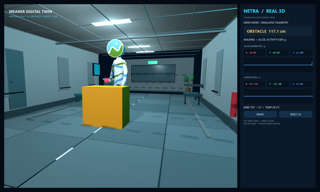
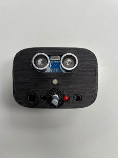

  

  <a href="https://www.flyvitech.com/">FlyVI Technologies</a>&nbsp;&nbsp;·&nbsp;&nbsp;
  <a href="https://github.com/Hitheshkaranth/noyce-ide-dist">Noyce IDE</a>&nbsp;&nbsp;·&nbsp;&nbsp;
  <a href="https://github.com/Hitheshkaranth?tab=repositories">Repositories</a>

I lead technology at [FlyVI Technologies](https://www.flyvitech.com/), where I work on high-reliability aerospace, defence, power-electronics, and embedded-control systems. My independent work focuses on tools that make complex engineering systems easier to inspect, operate, and verify.

## Building now

<table>
<tr>
<td width="120" align="center"></td>
<td>
<h3><a href="https://github.com/Hitheshkaranth/noyce-ide-dist">Noyce IDE</a></h3>

<strong>Proprietary software · Active development</strong>

An AI-native Code-OSS workbench for safety-critical firmware. Noyce connects requirements, source code, tests, traceability, MISRA analysis, CBMC, CodeQL, measured MC/DC, and hardware tooling in one environment.

Showcased at the <a href="https://gdg.community.dev/gdg-stanford/">Stanford × DeepMind Hackathon</a>.

</td>
</tr>
</table>

## Recognition

<table>
<tr>
<td width="120" align="center"></td>
<td>
<h3>WireVoice</h3>

<strong>Winner, Sarvam Epoch Buildathon 2026</strong>

A voice-first assistant for technicians working with complex electrical schematics. It locates terminals, wires, and connections, answers in the technician's preferred language, and cites the exact source sheet.

<a href="https://www.linkedin.com/posts/vinayakgavariya_buildwithsarvam-activity-7493728077878001664-BYc-">Read the winner announcement →</a>

</td>
</tr>
</table>

## Open source

<table>
<tr>
<td width="120" align="center"></td>
<td>
<h3><a href="https://github.com/Hitheshkaranth/OpenTerminalUI">OpenTerminalUI</a></h3>

A self-hosted financial terminal for traders, researchers, and quant teams. It combines multi-market data, professional charting, derivatives analytics, portfolio and risk workflows, backtesting, paper trading, and AI-assisted research.

&nbsp; <a href="https://github.com/Hitheshkaranth/OpenTerminalUI/blob/main/LICENSE">MIT licensed</a> · TypeScript · Python · FastAPI · React

</td>
</tr>

<tr>
<td width="120" align="center"></td>
<td>
<h3><a href="https://github.com/Hitheshkaranth/OpenTokenMonitor">OpenTokenMonitor</a></h3>

A local-first desktop monitor for Claude, Codex, Gemini, and other AI coding tools. It brings usage, quota windows, activity trends, and cost signals into one privacy-first application.

&nbsp; <a href="https://github.com/Hitheshkaranth/OpenTokenMonitor/blob/main/LICENSE">MIT licensed</a> · Rust · Tauri

</td>
</tr>

<tr>
<td width="120" align="center"></td>
<td>
<h3><a href="https://github.com/Hitheshkaranth/EmbeddedDisplayStudio">EmbeddedDisplayStudio</a></h3>

A desktop HMI studio for embedded Linux panels. It previews Qt applications at exact target geometry, deploys over SSH, checks application health, and automatically rolls back failed installations.

&nbsp; <a href="https://github.com/Hitheshkaranth/EmbeddedDisplayStudio/blob/main/LICENSE">MIT licensed</a> · Python · Qt · Embedded Linux

</td>
</tr>
</table>

## Selected systems work

<table>
<tr>
<td width="120" align="center"></td>
<td>
<h3><a href="https://github.com/Hitheshkaranth/arinc-615a-cli-tool-suite">ARINC 615A CLI Tool Suite</a></h3>

A C++23 command-line implementation of the ARINC 615A data-loading protocol. It discovers avionics targets, reads part information, transfers software over Ethernet, and manages ARINC 665 media sets.

</td>
</tr>

<tr>
<td width="120" align="center"></td>
<td>
<h3><a href="https://github.com/Hitheshkaranth/Netra_System_Debugger_V1">NETRA System Debugger</a></h3>

A PySide6 desktop debugger that turns wearable-device telemetry into sensor diagnostics, live plots, obstacle alerts, and an articulated 3D digital twin.

</td>
</tr>

<tr>
<td width="120" align="center"></td>
<td>
<h3><a href="https://github.com/Hitheshkaranth/Netra_Device_Firmware_V1">NETRA Device Firmware</a></h3>

ESP32-C6 firmware for ultrasonic obstacle ranging and six-axis MPU6050 motion telemetry, streamed over USB serial to the companion debugger.

</td>
</tr>
</table>

## Analytics & Activity

  <a href="https://github.com/Hitheshkaranth">
    <picture>
      <source media="(prefers-color-scheme: dark)" srcset="https://github-readme-activity-graph.vercel.app/graph?username=Hitheshkaranth&bg_color=1C1C1E&color=F5F5F7&line=2997FF&point=FF5F56&area=true&hide_border=true">
      
    </picture>
  </a>

  <a href="https://github.com/Hitheshkaranth">
    <picture>
      <source media="(prefers-color-scheme: dark)" srcset="https://github-readme-stats.vercel.app/api?username=Hitheshkaranth&show_icons=true&theme=transparent&title_color=2997FF&text_color=F5F5F7&icon_color=27C93F&hide_border=true">
      
    </picture>
  </a>
  <a href="https://github.com/Hitheshkaranth">
    <picture>
      <source media="(prefers-color-scheme: dark)" srcset="https://github-readme-stats.vercel.app/api/top-langs/?username=Hitheshkaranth&layout=compact&theme=transparent&title_color=2997FF&text_color=F5F5F7&hide_border=true">
      
    </picture>
  </a>

### Repository growth

  <a href="https://www.star-history.com/#Hitheshkaranth/OpenTerminalUI&Hitheshkaranth/OpenTokenMonitor&Date">
    <picture>
      <source media="(prefers-color-scheme: dark)" srcset="https://api.star-history.com/svg?repos=Hitheshkaranth/OpenTerminalUI%2CHitheshkaranth/OpenTokenMonitor&type=Date&theme=dark">
      
    </picture>
  </a>

## Contact

I am interested in collaboration around developer tools, financial infrastructure, applied voice AI, avionics, and embedded systems. The best place to start is through the relevant repository or [my GitHub profile](https://github.com/Hitheshkaranth).
