<!-- Artwork in assets/gen is generated by scripts/build.py. Edit the script, not the SVGs. -->

  <picture>
    <source media="(prefers-color-scheme: dark)" srcset="./assets/gen/hero-dark.svg">
    
  </picture>

  <a href="https://www.flyvitech.com/">FlyVI Technologies</a>
  &nbsp;·&nbsp;
  <a href="https://github.com/Hitheshkaranth/noyce-ide-dist">Noyce IDE</a>
  &nbsp;·&nbsp;
  <a href="https://github.com/Hitheshkaranth/OpenTerminalUI">OpenTerminalUI</a>
  &nbsp;·&nbsp;
  <a href="https://x.com/HitheshKaranth">@HitheshKaranth</a>

 

<picture>
  <source media="(prefers-color-scheme: dark)" srcset="./assets/gen/h-about-dark.svg">
  
</picture>

I lead technology at [FlyVI Technologies](https://www.flyvitech.com/), building high-reliability aerospace, defence, power-electronics and embedded-control systems. Outside of that I build developer tools, financial infrastructure, applied-AI products and self-hosted LLM inference, mostly in the open.

<picture>
  <source media="(prefers-color-scheme: dark)" srcset="./assets/gen/bento-dark.svg">
  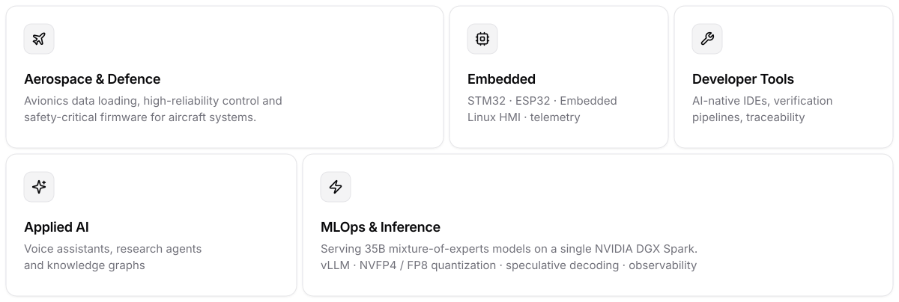
</picture>

  

<picture>
  <source media="(prefers-color-scheme: dark)" srcset="./assets/gen/h-now-dark.svg">
  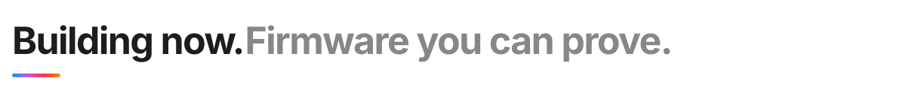
</picture>

<a href="https://github.com/Hitheshkaranth/noyce-ide-dist">
  <picture>
    <source media="(prefers-color-scheme: dark)" srcset="./assets/gen/card-noyce-dark.svg">
    
  </picture>
</a>

  

<picture>
  <source media="(prefers-color-scheme: dark)" srcset="./assets/gen/h-award-dark.svg">
  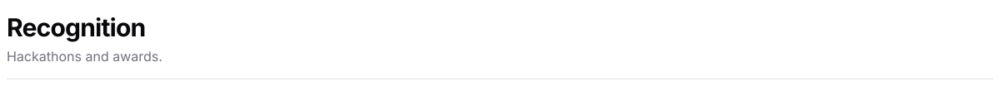
</picture>

<a href="https://www.linkedin.com/posts/vinayakgavariya_buildwithsarvam-activity-7493728077878001664-BYc-">
  <picture>
    <source media="(prefers-color-scheme: dark)" srcset="./assets/gen/card-wirevoice-dark.svg">
    
  </picture>
</a>

  

<picture>
  <source media="(prefers-color-scheme: dark)" srcset="./assets/gen/h-oss-dark.svg">
  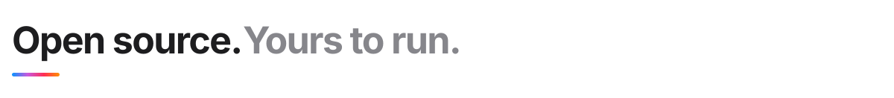
</picture>

<a href="https://github.com/Hitheshkaranth/OpenTerminalUI">
  <picture>
    <source media="(prefers-color-scheme: dark)" srcset="./assets/gen/card-openterminalui-dark.svg">
    
  </picture>
</a>
<a href="https://github.com/Hitheshkaranth/OpenTokenMonitor">
  <picture>
    <source media="(prefers-color-scheme: dark)" srcset="./assets/gen/card-opentokenmonitor-dark.svg">
    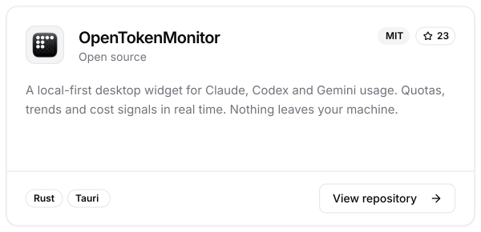
  </picture>
</a>
<a href="https://github.com/Hitheshkaranth/EmbeddedDisplayStudio">
  <picture>
    <source media="(prefers-color-scheme: dark)" srcset="./assets/gen/card-eds-dark.svg">
    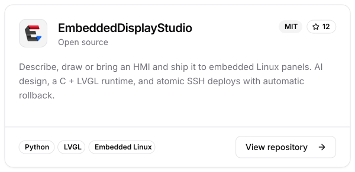
  </picture>
</a>

  

<picture>
  <source media="(prefers-color-scheme: dark)" srcset="./assets/gen/h-systems-dark.svg">
  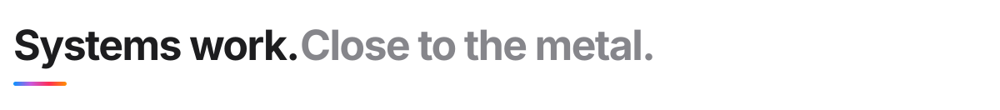
</picture>

<a href="https://github.com/Hitheshkaranth/arinc-615a-cli-tool-suite">
  <picture>
    <source media="(prefers-color-scheme: dark)" srcset="./assets/gen/card-arinc-dark.svg">
    
  </picture>
</a>
<a href="https://github.com/Hitheshkaranth/Netra_System_Debugger_V1">
  <picture>
    <source media="(prefers-color-scheme: dark)" srcset="./assets/gen/card-netra-debugger-dark.svg">
    
  </picture>
</a>
<a href="https://github.com/Hitheshkaranth/Netra_Device_Firmware_V1">
  <picture>
    <source media="(prefers-color-scheme: dark)" srcset="./assets/gen/card-netra-device-dark.svg">
    
  </picture>
</a>

  

<picture>
  <source media="(prefers-color-scheme: dark)" srcset="./assets/gen/h-mlops-dark.svg">
  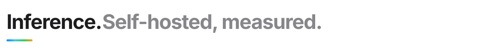
</picture>

<picture>
  <source media="(prefers-color-scheme: dark)" srcset="./assets/gen/inference-dark.svg">
  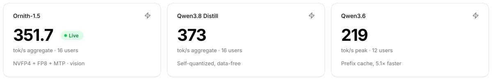
</picture>

<a href="https://github.com/Hitheshkaranth/Ornith-1.5_A3B_Model_DGX_Spark_Setup">
  <picture>
    <source media="(prefers-color-scheme: dark)" srcset="./assets/gen/card-ornith-dark.svg">
    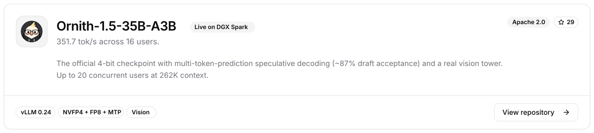
  </picture>
</a>
<a href="https://github.com/Hitheshkaranth/Qwen-3_8_A3B_Model_DGX_Spark_Setup">
  <picture>
    <source media="(prefers-color-scheme: dark)" srcset="./assets/gen/card-qwen38-dark.svg">
    
  </picture>
</a>
<a href="https://github.com/Hitheshkaranth/Qwen-3_6_Model_DGX_Spark_Setup">
  <picture>
    <source media="(prefers-color-scheme: dark)" srcset="./assets/gen/card-qwen36-dark.svg">
    
  </picture>
</a>

  

<picture>
  <source media="(prefers-color-scheme: dark)" srcset="./assets/gen/h-stack-dark.svg">
  
</picture>

  <picture>
    <source media="(prefers-color-scheme: dark)" srcset="https://skillicons.dev/icons?i=c,cpp,rust,py,ts,react,fastapi,qt,tauri,electron,linux,arduino,raspberrypi&perline=13&theme=dark">
    
  </picture>

MISRA · CBMC · CodeQL · MC/DC · vLLM · NVFP4 / FP8 · Prometheus · Grafana · DCGM · Tailscale

 

<picture>
  <source media="(prefers-color-scheme: dark)" srcset="./assets/gen/h-activity-dark.svg">
  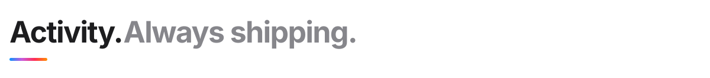
</picture>

  <picture>
    <source media="(prefers-color-scheme: dark)" srcset="https://raw.githubusercontent.com/Hitheshkaranth/Hitheshkaranth/output/snake-dark.svg">
    
  </picture>

  <a href="https://www.star-history.com/#Hitheshkaranth/OpenTerminalUI&Hitheshkaranth/OpenTokenMonitor&Hitheshkaranth/EmbeddedDisplayStudio&Date">
    <picture>
      <source media="(prefers-color-scheme: dark)" srcset="https://api.star-history.com/svg?repos=Hitheshkaranth/OpenTerminalUI%2CHitheshkaranth/OpenTokenMonitor%2CHitheshkaranth/EmbeddedDisplayStudio&type=Date&theme=dark">
      
    </picture>
  </a>

 

  <a href="https://x.com/HitheshKaranth"><picture><source media="(prefers-color-scheme: dark)" srcset="./assets/gen/dock-x-dark.svg"></picture></a>
  &nbsp;
  <a href="https://www.flyvitech.com/"><picture><source media="(prefers-color-scheme: dark)" srcset="./assets/gen/dock-web-dark.svg"></picture></a>
  &nbsp;
  <a href="https://github.com/Hitheshkaranth?tab=repositories"><picture><source media="(prefers-color-scheme: dark)" srcset="./assets/gen/dock-repos-dark.svg"></picture></a>
  &nbsp;
  <a href="https://github.com/Hitheshkaranth"><picture><source media="(prefers-color-scheme: dark)" srcset="./assets/gen/dock-github-dark.svg"></picture></a>

Open to collaboration on developer tools, financial infrastructure, voice AI, self-hosted inference, avionics and embedded systems. The best way to start is an issue or discussion on the relevant repository.

<picture>
  <source media="(prefers-color-scheme: dark)" srcset="./assets/gen/footer-dark.svg">
  
</picture>
