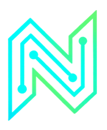
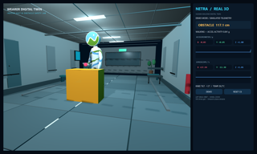
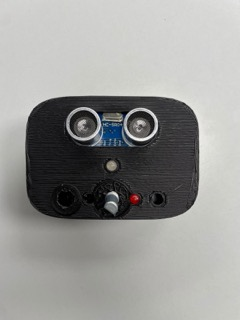
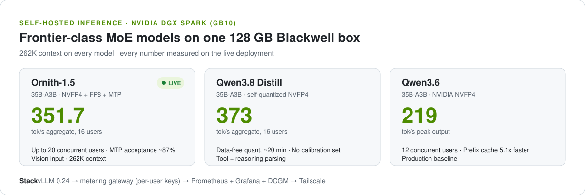
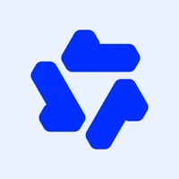

  

<h3 align="center">Building tools that make complex engineering systems easier to inspect, operate, and verify.</h3>

  <a href="https://www.flyvitech.com/"><strong>FlyVI Technologies</strong></a>
  &nbsp;&nbsp;·&nbsp;&nbsp;
  <a href="#building-now">Noyce IDE</a>
  &nbsp;&nbsp;·&nbsp;&nbsp;
  <a href="#open-source">Open Source</a>
  &nbsp;&nbsp;·&nbsp;&nbsp;
  <a href="#selected-systems-work">Systems Work</a>
  &nbsp;&nbsp;·&nbsp;&nbsp;
  <a href="#mlops--inference-on-dgx-spark">MLOps</a>
  &nbsp;&nbsp;·&nbsp;&nbsp;
  <a href="#contact">Contact</a>

 

I lead technology at [FlyVI Technologies](https://www.flyvitech.com/), where I work on high-reliability aerospace, defence, power-electronics, and embedded-control systems. Outside of that, I build developer tools, financial infrastructure, applied-AI products, and self-hosted LLM inference — mostly in the open.

<table width="100%">
<tr>
<td width="20%" valign="top" align="center">
  <strong>✈️&nbsp; Aerospace &amp; Defence</strong> 
  Avionics data loading, high-reliability control, safety-critical firmware
</td>
<td width="20%" valign="top" align="center">
  <strong>🔩&nbsp; Embedded Systems</strong> 
  ESP32 · STM32 · Embedded Linux HMI · sensor telemetry
</td>
<td width="20%" valign="top" align="center">
  <strong>🧰&nbsp; Developer Tools</strong> 
  AI-native IDEs, verification pipelines, traceability
</td>
<td width="20%" valign="top" align="center">
  <strong>🧠&nbsp; Applied AI</strong> 
  Voice assistants, research agents, knowledge graphs
</td>
<td width="20%" valign="top" align="center">
  <strong>⚡&nbsp; MLOps &amp; Inference</strong> 
  vLLM · NVFP4 quantization · DGX Spark · observability
</td>
</tr>
</table>

 

## Building now

<table width="100%">
<tr>
<td width="140" align="center" valign="middle">
  
</td>
<td valign="middle">
  <h3><a href="https://github.com/Hitheshkaranth/noyce-ide-dist">Noyce IDE</a> &nbsp;<code>Proprietary</code>&nbsp;<code>Active development</code></h3>
  
An AI-native Code-OSS workbench for safety-critical firmware. Noyce connects requirements, source code, tests, traceability, MISRA analysis, CBMC, CodeQL, measured MC/DC, and hardware tooling in one environment — so a firmware team can see, prove, and ship from a single place.

  
🎓&nbsp; Showcased at the <a href="https://gdg.community.dev/gdg-stanford/">Stanford × DeepMind Hackathon</a>

</td>
</tr>
</table>

## Recognition

<table width="100%">
<tr>
<td width="140" align="center" valign="middle">
  
</td>
<td valign="middle">
  <h3>WireVoice &nbsp;<code>🏆 Winner · Sarvam Epoch Buildathon 2026</code></h3>
  
A voice-first assistant for technicians working with complex electrical schematics. It locates terminals, wires, and connections, answers in the technician's preferred language, and cites the exact source sheet every time.

  
<a href="https://www.linkedin.com/posts/vinayakgavariya_buildwithsarvam-activity-7493728077878001664-BYc-">Read the winner announcement →</a>

</td>
</tr>
</table>

## Open source

<table width="100%">
<tr>
<td width="140" align="center" valign="middle">
  
</td>
<td valign="middle">
  <h3><a href="https://github.com/Hitheshkaranth/OpenTerminalUI">OpenTerminalUI</a></h3>
  
A self-hosted financial terminal for traders, researchers, and quant teams. Multi-market data, professional charting, derivatives analytics, portfolio and risk workflows, backtesting, paper trading, and an AI research agent — on your own hardware.

  

    
    
    &nbsp;TypeScript · React · Python · FastAPI
  

</td>
</tr>

<tr>
<td width="140" align="center" valign="middle">
  
</td>
<td valign="middle">
  <h3><a href="https://github.com/Hitheshkaranth/OpenTokenMonitor">OpenTokenMonitor</a></h3>
  
A local-first desktop monitor for Claude, Codex, Gemini, and other AI coding tools. Usage, quota windows, activity trends, and cost signals in one privacy-first application — nothing leaves your machine.

  

    
    
    &nbsp;Rust · Tauri
  

</td>
</tr>

<tr>
<td width="140" align="center" valign="middle">
  
</td>
<td valign="middle">
  <h3><a href="https://github.com/Hitheshkaranth/EmbeddedDisplayStudio">EmbeddedDisplayStudio</a></h3>
  
A desktop HMI studio for embedded Linux panels. Previews Qt applications at exact target geometry, deploys over SSH, checks application health, and automatically rolls back failed installations.

  

    
    
    &nbsp;Python · Qt · Embedded Linux
  

</td>
</tr>
</table>

## Selected systems work

<table width="100%">
<tr>
<td width="140" align="center" valign="middle">
  
</td>
<td valign="middle">
  <h3><a href="https://github.com/Hitheshkaranth/arinc-615a-cli-tool-suite">ARINC 615A CLI Tool Suite</a></h3>
  
A C++23 command-line implementation of the ARINC 615A data-loading protocol. Discovers avionics targets, reads part information, transfers software over Ethernet, and manages ARINC 665 media sets.

  
C++23 · ARINC 615A · ARINC 665 · Avionics

</td>
</tr>

<tr>
<td width="140" align="center" valign="middle">
  
</td>
<td valign="middle">
  <h3><a href="https://github.com/Hitheshkaranth/Netra_System_Debugger_V1">NETRA System Debugger</a></h3>
  
A PySide6 desktop debugger that turns wearable-device telemetry into sensor diagnostics, live plots, obstacle alerts, and an articulated 3D digital twin.

  
Python · PySide6 · 3D digital twin · Telemetry

</td>
</tr>

<tr>
<td width="140" align="center" valign="middle">
  
</td>
<td valign="middle">
  <h3><a href="https://github.com/Hitheshkaranth/Netra_Device_Firmware_V1">NETRA Device Firmware</a></h3>
  
ESP32-C6 firmware for ultrasonic obstacle ranging and six-axis MPU6050 motion telemetry, streamed over USB serial to the companion debugger.

  
C · ESP32-C6 · MPU6050 · Ultrasonic sensing

</td>
</tr>
</table>

## Toolbox

<table width="100%">
<tr>
<td width="16%" valign="top"><strong>Languages</strong> C · C++23 · Rust · Python · TypeScript</td>
<td width="16%" valign="top"><strong>Embedded</strong> STM32 · ESP32 · Embedded Linux · Qt HMI · USB / serial telemetry</td>
<td width="16%" valign="top"><strong>Verification &amp; Safety</strong> MISRA · CBMC · CodeQL · MC/DC coverage · requirements traceability</td>
<td width="16%" valign="top"><strong>Desktop &amp; Web</strong> Tauri · Electron / Code-OSS · React · FastAPI · PySide6</td>
<td width="16%" valign="top"><strong>AI</strong> Tool-using agents · voice interfaces · knowledge graphs · Claude / Gemini / Codex</td>
<td width="16%" valign="top"><strong>MLOps</strong> vLLM · NVFP4 / FP8 quantization · speculative decoding · Prometheus / Grafana</td>
</tr>
</table>

## Activity

  <a href="https://github.com/Hitheshkaranth?tab=overview">
    <picture>
      <source media="(prefers-color-scheme: dark)" srcset="https://github-profile-summary-cards.vercel.app/api/cards/profile-details?username=Hitheshkaranth&theme=github_dark">
      
    </picture>
  </a>

  <a href="https://github.com/Hitheshkaranth?tab=repositories">
    <picture>
      <source media="(prefers-color-scheme: dark)" srcset="https://github-profile-summary-cards.vercel.app/api/cards/repos-per-language?username=Hitheshkaranth&theme=github_dark">
      
    </picture>
  </a>
  <a href="https://github.com/Hitheshkaranth?tab=repositories">
    <picture>
      <source media="(prefers-color-scheme: dark)" srcset="https://github-profile-summary-cards.vercel.app/api/cards/most-commit-language?username=Hitheshkaranth&theme=github_dark">
      
    </picture>
  </a>

  <a href="https://www.star-history.com/#Hitheshkaranth/OpenTerminalUI&Hitheshkaranth/OpenTokenMonitor&Hitheshkaranth/EmbeddedDisplayStudio&Date">
    <picture>
      <source media="(prefers-color-scheme: dark)" srcset="https://api.star-history.com/svg?repos=Hitheshkaranth/OpenTerminalUI%2CHitheshkaranth/OpenTokenMonitor%2CHitheshkaranth/EmbeddedDisplayStudio&type=Date&theme=dark&v=202609132354">
      
    </picture>
  </a>

## MLOps · Inference on DGX Spark

Open-source, reproducible recipes for serving 35B-parameter Mixture-of-Experts models on a single **NVIDIA DGX Spark (GB10, 128 GB unified memory)** — quantization, vLLM serving, a per-user metering gateway, and Prometheus/Grafana observability. Every benchmark in these repos was measured on the running deployment.

  <picture>
    <source media="(prefers-color-scheme: dark)" srcset="./assets/dgx-spark-inference-v3-dark.svg">
    
  </picture>

<table width="100%">
<tr>
<td width="140" align="center" valign="middle">
  
</td>
<td valign="middle">
  <h3><a href="https://github.com/Hitheshkaranth/Ornith-1.5_A3B_Model_DGX_Spark_Setup">Ornith-1.5-35B-A3B</a> &nbsp;<code>Live</code>&nbsp;<code>NVFP4 + FP8 + MTP</code></h3>
  
Serves the official 4-bit Ornith-1.5 checkpoint with multi-token-prediction speculative decoding (~87% draft acceptance) and a real vision tower for image input — 351.7 tok/s aggregate across 16 users, with up to 20 concurrent users at 262K context.

  

    
    
    &nbsp;vLLM 0.24 · MTP · Vision · MMLU-Pro
  

</td>
</tr>

<tr>
<td width="140" align="center" valign="middle">
  
</td>
<td valign="middle">
  <h3><a href="https://github.com/Hitheshkaranth/Qwen-3_8_A3B_Model_DGX_Spark_Setup">Qwen3.8-35B-A3B Distill</a> &nbsp;<code>Self-quantized</code></h3>
  
A data-free NVFP4-experts + FP8-attention quantization pipeline that streams one shard at a time (~20 min, a few GB of RAM), working around two quantizer bugs — then serves 16 concurrent users at 373 tok/s aggregate.

  

    
    
    &nbsp;ModelOpt · NVFP4 · vLLM · Tailscale gateway
  

</td>
</tr>

<tr>
<td width="140" align="center" valign="middle">
  
</td>
<td valign="middle">
  <h3><a href="https://github.com/Hitheshkaranth/Qwen-3_6_Model_DGX_Spark_Setup">Qwen3.6-35B-A3B-NVFP4</a> &nbsp;<code>Production recipe</code></h3>
  
The one-script production deployment of NVIDIA's NVFP4 Qwen3.6: 12 concurrent users, 219 tok/s peak output, and prefix caching that makes shared-prompt sessions 5.1× faster — with the Prometheus + Grafana + DCGM stack included.

  

    
    
    &nbsp;vLLM · Prefix caching · Prometheus · Grafana · DCGM
  

</td>
</tr>
</table>

## Contact

I'm open to collaboration around developer tools, financial infrastructure, applied voice AI, self-hosted LLM inference, avionics, and embedded systems.

  
  

The best way to start a conversation is to open an issue or discussion on the relevant repository.

 

Thanks for stopping by.

